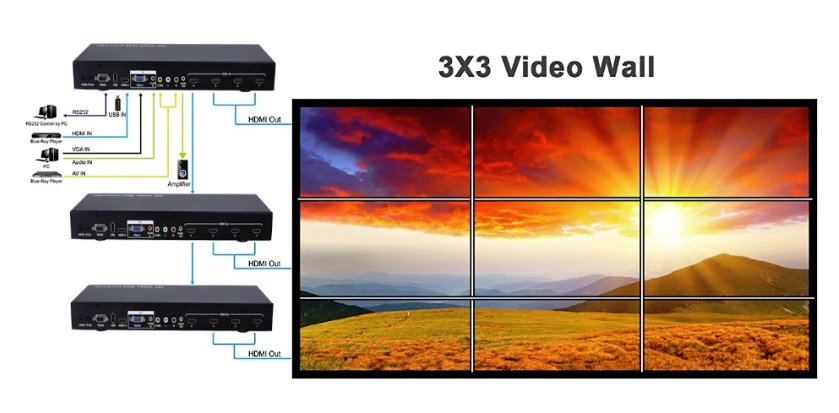

# Virtual-City-Windows
Connect the world together with interactive screen installations all over the globe.

### Mission

My friend Dario came up with this idea, which he already had some years ago with another friend of his. They thought it would be a great idea to get in touch with other people that way.  
Actually the have been thinking about getting - physically - quite close to the screens (aka Virtual City Windows), so that even an "almost touch" is possible.

That is the reason why we want a big, **Life-Size** installation. We are thinking about an **3x3 array of apx. 40" television screens**. Maybe also rotated 90° (see Possible Components)

   
*Image as reference*

Our idea is to bring 2-3 connected stations/cities together for a start. For a proof of concept and a working prototype and then go on with a Kickstarter- or Indiegogo-Campaign to raise money for further features like more and deeper interaction like **Realtime-Language Translation**.

There are many more features we can think of and also are curious on your ideas and input.

### Vision

**NOTE** we want to emphasize that we are glad for any help and input. Everybody is welcome to JOIN the project. 

**BUT** we also want to emphasize that we think - before we go on with further ideas - and not to go astray we find it necessary to have 2-3 **WORKING** prototypes **FIRST**.

After that - and that we are pretty sure about - it will be much easier to raise fund for further ideas.

Besides the communicating software in the first version, we think that every location can and should have their own idea about what the virtual window should look like. So even the software in future versions will only have to comply to a set of interfaces and communication end-points.

### You can reach out:

* directly via email to ideas@txplosion.com
* join the discussion at [our Flarum Discussion](https://discuss.txplosion.com)
* initial [Server-Software](https://github.com/dariogreggio/VideoSender)
